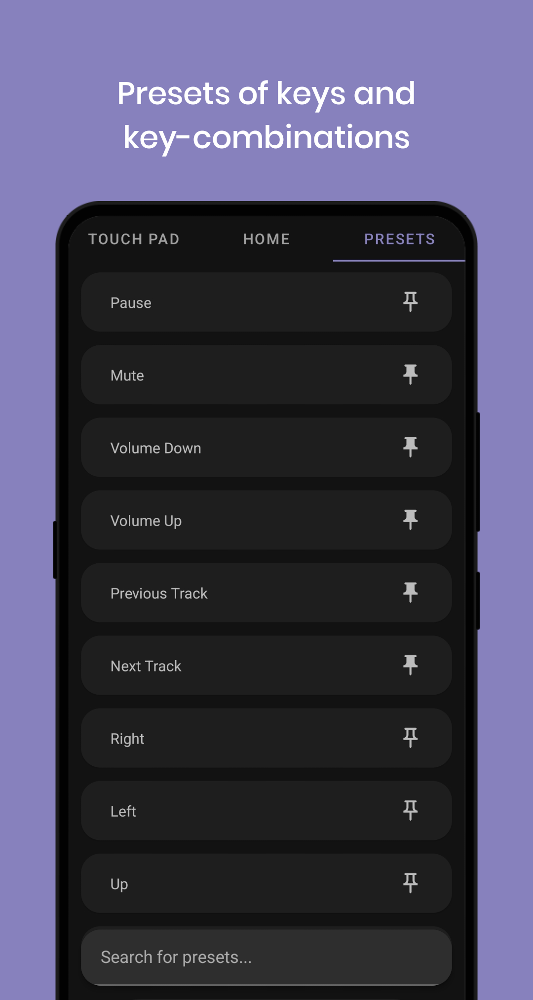
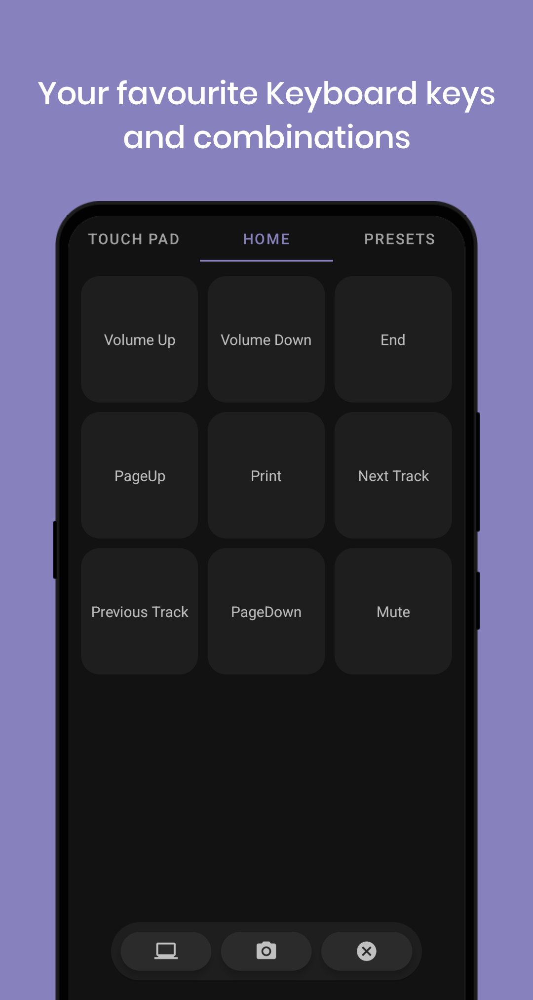
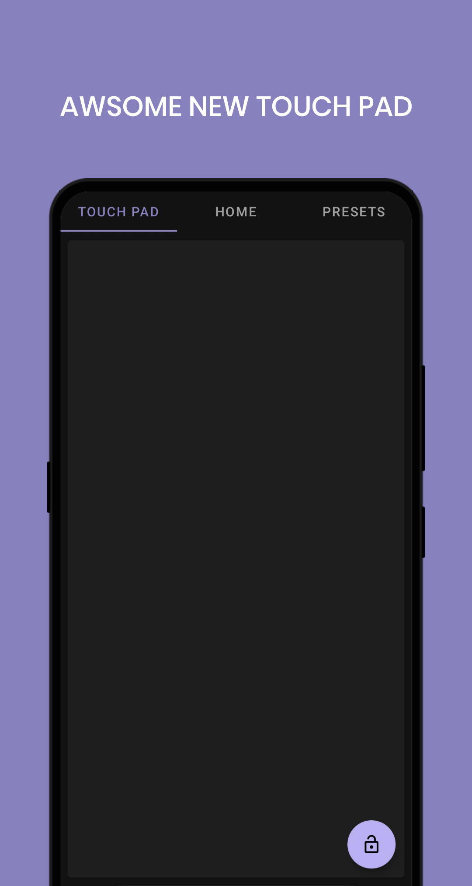

# Macronium
Let's you use Windows shortcuts like Screenshot, Media controls, f13 - f14 keys, and a lot more on your PC using Android.

# Instructions
- Download latest version Macronium-PC.zip on your PC from [here](https://github.com/supersu-man/Macronium-PC/releases).
- Extract the zip on your PC, open macronium.exe.
- Download the latest Macronium on your phone from [Github](https://github.com/supersu-man/Macronium/releases) or [Playstore](https://play.google.com/store/apps/details?id=com.supersuman.macronium).
- Make sure Phone and PC are connected same WiFi.
- Scan the QR on Macronium-PC using Macronium on your phone.
- You are good to go.

